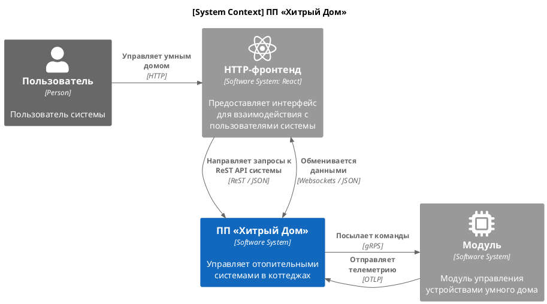

# Диаграмма контекста системы (C4 System Context)

```puml
@startuml
!include <C4/C4_Context>
!include <tupadr3/common>
!include <tupadr3/devicons2/react_original>
!include <tupadr3/font-awesome-6/microchip>

title [System Context] ПП «Хитрый Дом»

Person_Ext(customer, "Пользователь", "Пользователь системы", \
    $type=Person)

System_Ext(module, "Модуль", "Модуль управления устройствами умного дома", \
    $sprite=microchip, $type="Software System")
System_Ext(frontend, "HTTP-фронтенд", \
    "Предоставляет интерфейс для взаимодействия с пользователями системы", \
    $sprite=react_original, $type="Software System: React")

System(smart_home, "ПП «Хитрый Дом»", \
    "Управляет отопительными системами в коттеджах", \
    $type="Software System", $link="../02_C4_containers/")

Rel_R(customer, frontend, "Управляет умным домом", $techn="HTTP")
Rel(frontend, smart_home, "Направляет запросы к ReST API системы", \
    $techn="ReST / JSON")
BiRel(frontend, smart_home, "Обменивается данными", \
    $techn="Websockets / JSON")

Rel_L(smart_home, module, "Посылает команды", $techn="gRPS")
Rel_L(module, smart_home, "Отправляет телеметрию", $techn="OTLP")

@enduml
```
