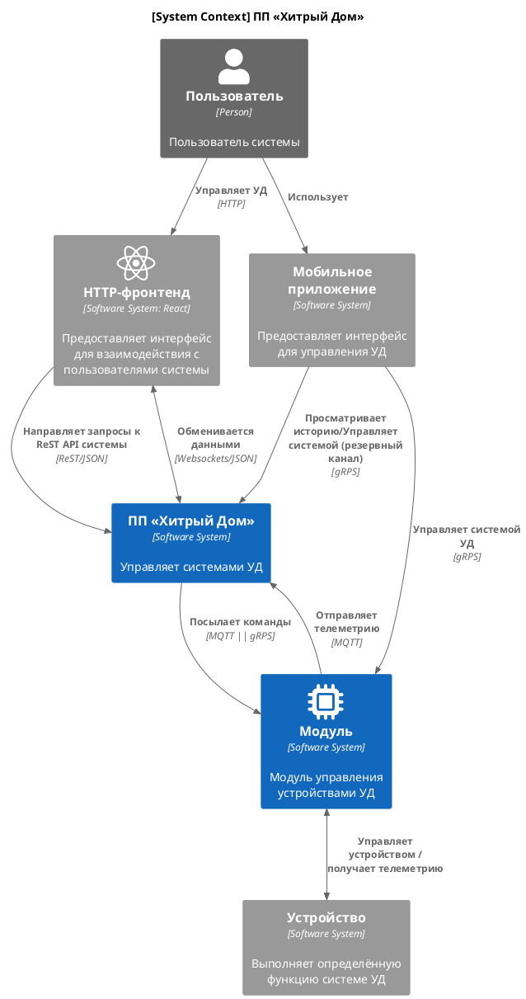

# Диаграмма контекста системы (C4)

Поскольку команда разработчиков у компании небольшая, и значительные средства пришлось вложить в заказное производство модулей, руководством (будем считать) было принято решение на начальном этапе осуществить создания мобильного приложения для непосредственного управлениями системами УД методом аутсорсинга.

В будущем следует рассматривать сценарий с разработкой и поддержкой 2-х версий мобильного приложения: одну, бесплатную с минимально интересным для потребителей функционалом, а другую, максимально удобную и полезную — платную. Для Android, для iOS можно только платную.

Как видно на диаграмме, «прошивка» модулей была реализована с поддержкой 2-х протоколов MQTT и gRPS.

Рискну предположить, что по мнению создателей курса, для нас, студентов, особенную радость доставляет возможность создания интерактивных диаграмм. Пожалуйста, кликните (1 раз левой кнопкой) на синем прямоугольнике с надписью ПП «Хитрый дом»!
