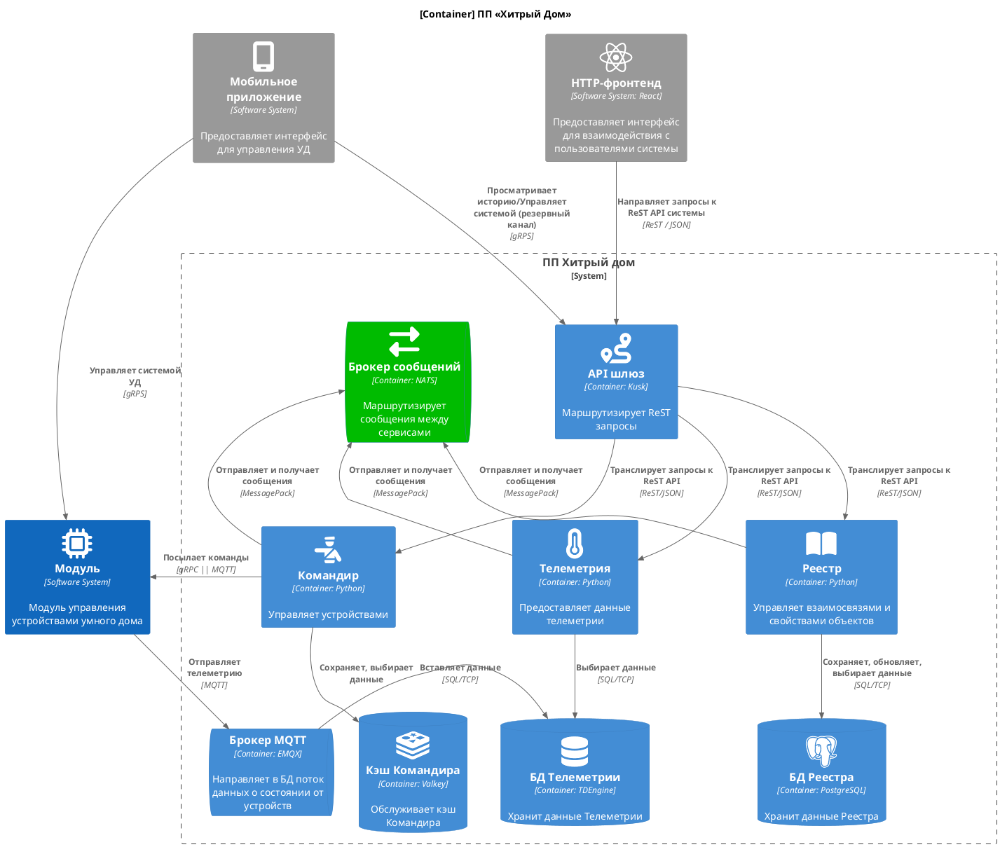

# Диаграмма контейнеров (С4)

Более подробно технические аспекты решения можно рассмотреть на диаграмме контейнеров. На схеме обозначены только имеющие непосредственное отношение управлению системами УД и сбором данных телеметрии. Микросервисы, предназначенные для управления пользователями, обслуживания бизнес-аудита и т.п., не изображены.

Зелёным цветом выделен контейнер брокера сообщений, т.к. реализация асинхронного взаимодействия между контейнерами внутри системы запланирована на следующую итерацию. В первое время подключений будет не так много, и ReST API микросервисов, полагаю, успешно справится с нагрузкой.

По правде говоря, не хватило мне опыта, чтобы разработать схему асинхронного API, а времени не хватило, чтобы реализовать какие-то прототипы микросервисов, «пощупать» их, а потом уж взяться за разработку схемы. Мне доводилось работать с Celery на Python, но там несколько иная парадигма.

## О выборе программ

Несколько слов о выборе того или иного программного продукта для конкретной задачи.

* В качестве API-шлюза (прямо в задании был предложен) [Kusk](https://kusk.io/). Ничего не имею против (но для реального проекта поискал что-нибудь поживее). Попробовать не успел, но то, что он open source — это уже хорошо. Не очень хорошо, то что он 2 года никак не развивается, если верить GitHub'у.

* Кэш микросервиса «Командир». С тех пор, как Redis сменил лицензию, [Valkey](https://valkey.io/) — весьма достойная замена.

* Брокер сообщений. Не смотря на то, что в задании ненавязчиво предлагалась Kafka, всё же я предпочёл [NATS](https://nats.io/). Он написан на Go — теоретически, более быстрый, менее ресурсоёмкий, проще развёртываемый, динамично развивающийся.

* Брокер MQTT. Просто остановился на лидере [EMQX](https://www.emqx.com/en). Со временем (и средствами на эксперименты) можно мигрировать на OSS-решение. 

* БД Телеметрии. Пока остановился на [TDengine](https://tdengine.com/). На сайте *красивые* графики, open source, развивается.

Безусловно, любой подобный выбор необходимо делать только проведения нагрузочных испытаний на стенде, который максимально полно воспроизводил бы особенности работы проектируемого комплекса приложений.

## О развёртывании

На первом этапе инфраструктуру желательно развернуть в Kubernates в одном ДЦ, так чтобы те приложения, которые могут быть развёрнуты в кластерном варианте, были запущены в кластерном. Бэкап следует настроить и вынести в другой ДЦ. При таком развёртывании непредвиденный даунтайм возможен, но 1) инцидент должен быть весьма серьёзным, что происходит крайне редко, 2) восстановить работу системы можно достаточно быстро и при наличии свежих бэкапов данные почти не утратятся.

В дальнейшем, когда доходы предприятия позволят подобную экспансию проводить не в убыток, будет иметь смысл развернуть аналогичную группу контейнеров в другом ДЦ. Между площадками потребуется настроить репликацию и автоматическую балансировку.

Затем целесообразно довести количество площадок до 3-х. При этом следует учитывать географическое распределение подключенных к системе домохозяйств с тем расчётом, чтобы данные телеметрии можно было шардировать по географическому признаку.
