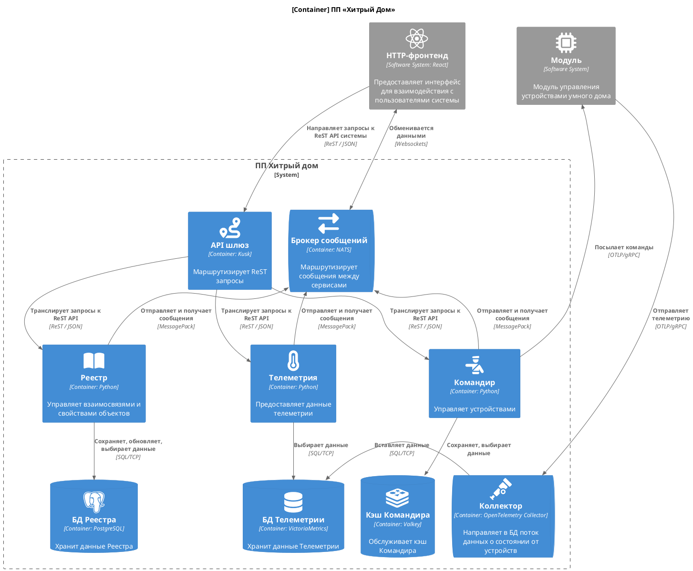

# Диаграмма контейнеров (С4 Container Diagram)

Более подробно технические аспекты решения можно рассмотреть на диаграмме контейнеров.

```puml
@startuml
!include <C4/C4_Container>
!include <tupadr3/common>
!include <tupadr3/devicons2/opentelemetry>
!include <tupadr3/devicons2/postgresql>
!include <tupadr3/devicons2/react_original>
!include <tupadr3/devicons2/redis>
!include <tupadr3/font-awesome-6/book_open>
!include <tupadr3/font-awesome-6/database>
!include <tupadr3/font-awesome-6/microchip>
!include <tupadr3/font-awesome-6/person_military_pointing>
!include <tupadr3/font-awesome-6/right_left>
!include <tupadr3/font-awesome-6/route>
!include <tupadr3/font-awesome-6/temperature_three_quarters>

title [Container] ПП «Хитрый Дом»

System_Ext(frontend, "HTTP-фронтенд", \
    "Предоставляет интерфейс для взаимодействия с пользователями системы", \
    $sprite=react_original, $type="Software System: React")
System_Ext(module, "Модуль", "Модуль управления устройствами умного дома", \
    $sprite=microchip, $type="Software System")

System_Boundary(c1, "ПП Хитрый дом") {
    ContainerQueue(broker, "Брокер сообщений", "Container: NATS", \
        "Маршрутизирует сообщения между сервисами", $sprite=right_left)
    Container(apigw, "API шлюз", "Container: Kusk", \
        "Маршрутизирует ReST запросы", $sprite=route)
    ContainerQueue(collector, "Коллектор", \
        "Container: OpenTelemetry Collector", \
        "Направляет в БД поток данных о состоянии от устройств", \
        $sprite=opentelemetry)

    Container(inventory, "Реестр", "Container: Python", \
        "Управляет взаимосвязями и свойствами объектов", $sprite=book_open, \
        $link="../03_C4_component_inventory/")
    Container(commander, "Командир",  "Container: Python", \
        "Управляет устройствами", $sprite=person_military_pointing, \
        $link="../04_C4_component_commander/")
    Container(telemetry, "Телеметрия", "Container: Python", \
        "Предоставляет данные телеметрии", \
        $sprite=temperature_three_quarters, \
        $link="../05_C4_component_telemetry/")

    
    ContainerDb(db_inventory, "БД Реестра", \
        "Container: PostgreSQL", "Хранит данные Реестра", $sprite=postgresql)    
    ContainerDb(cache_commander, "Кэш Командира", \
        "Container: Valkey", "Обслуживает кэш Командира", $sprite=redis)
    ContainerDb(db_telemetry, "БД Телеметрии", "Container: VictoriaMetrics", \
        "Хранит данные Телеметрии", $sprite=database)
}

Lay_R(frontend, module)
' It works!
Lay_U(c1, frontend) 
' It works!
Lay_U(c1, module)   
' It works!
Lay_U(c1, module)   

Lay_R(broker, apigw)

Rel(inventory, broker, "Отправляет и получает сообщения", $techn="MessagePack")
Rel(commander, broker, "Отправляет и получает сообщения", $techn="MessagePack")
Rel(telemetry, broker, "Отправляет и получает сообщения", $techn="MessagePack")

Rel(inventory, db_inventory, "Сохраняет, обновляет, выбирает данные", \
    $techn="SQL/TCP")
Rel(commander, cache_commander, "Сохраняет, выбирает данные")
Rel(telemetry, db_telemetry, "Выбирает данные", $techn="SQL/TCP")

Rel(apigw, inventory, "Транслирует запросы к ReST API", $techn="ReST / JSON")
Rel(apigw, commander, "Транслирует запросы к ReST API", $techn="ReST / JSON")
Rel(apigw, telemetry, "Транслирует запросы к ReST API", $techn="ReST / JSON")

Rel(frontend, apigw, "Направляет запросы к ReST API системы", \
    $techn="ReST / JSON")
BiRel(frontend, broker, "Обменивается данными", $techn="Websockets")

Rel(commander, module, "Посылает команды", $techn="OTLP/gRPC")
Rel(module, collector, "Отправляет телеметрию", $techn="OTLP/gRPC")
Rel_L(collector, db_telemetry, "Вставляет данные", $techn="SQL/TCP")

@enduml 
```
