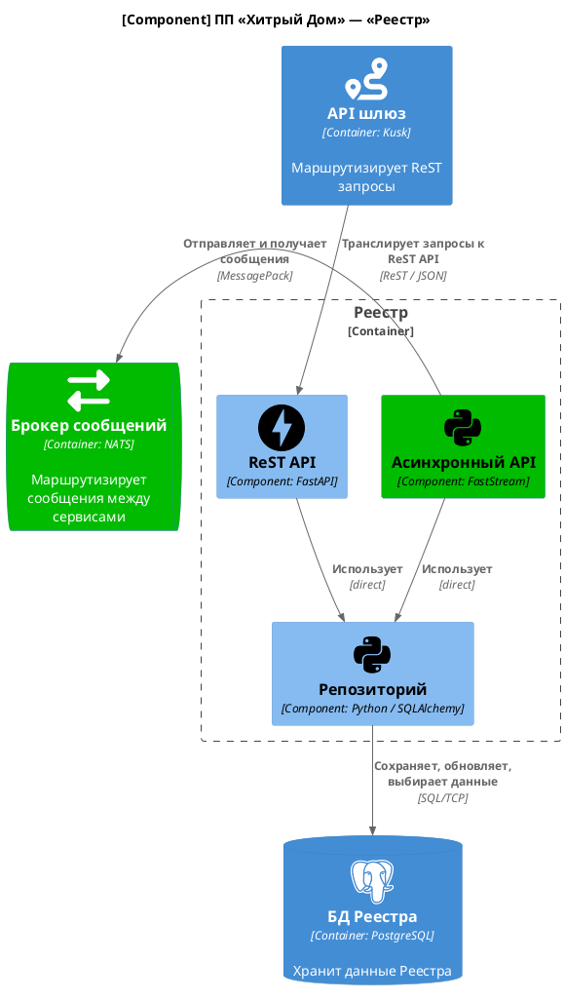

# Диаграмма компонента «Реестр» (C4)

```puml
@startuml
!include <C4/C4_Component>
!include <tupadr3/common>
!include <tupadr3/devicons2/fastapi>
!include <tupadr3/devicons2/postgresql>
!include <tupadr3/font-awesome-6/python>
!include <tupadr3/font-awesome-6/right_left>
!include <tupadr3/font-awesome-6/route>

title [Component] ПП «Хитрый Дом» — «Реестр»

'System_Ext(frontend, "HTTP-фронтенд", \
    "Предоставляет интерфейс для взаимодействия с пользователями системы", \
    $sprite=react_original, $type="Software System: React")

Container(apigw, "API шлюз", "Container: Kusk", \
    "Маршрутизирует ReST запросы", $sprite=route)
    
ContainerQueue(broker, "Брокер сообщений", "Container: NATS", \
    "Маршрутизирует сообщения между сервисами", $sprite=right_left) #00bb00

Container_Boundary(cb, "Реестр") {
    Component(inventory_repo, "Репозиторий", \
    "Component: Python / SQLAlchemy", $sprite=python)
    Component(inventory_rest, "ReST API", "Component: FastAPI", \
        $sprite=fastapi)
    Component(inventory_async, "Асинхронный API", "Component: FastStream", \
        $sprite=python) #00bb00
}

ContainerDb(db_inventory, "БД Реестра", \
    "Container: PostgreSQL", "Хранит данные Реестра", $sprite=postgresql, \
    $link="../06_ER_inventory/")

Rel(inventory_rest, inventory_repo, "Использует", $techn="direct")
Rel(inventory_async, inventory_repo, "Использует", $techn="direct")
Rel(inventory_repo, db_inventory, "Сохраняет, обновляет, выбирает данные", \
    $techn="SQL/TCP")

Rel(apigw, inventory_rest, "Транслирует запросы к ReST API", \
    $techn="ReST / JSON")
Rel_L(inventory_async, broker, "Отправляет и получает сообщения", \
    $techn="MessagePack")

@enduml
```
