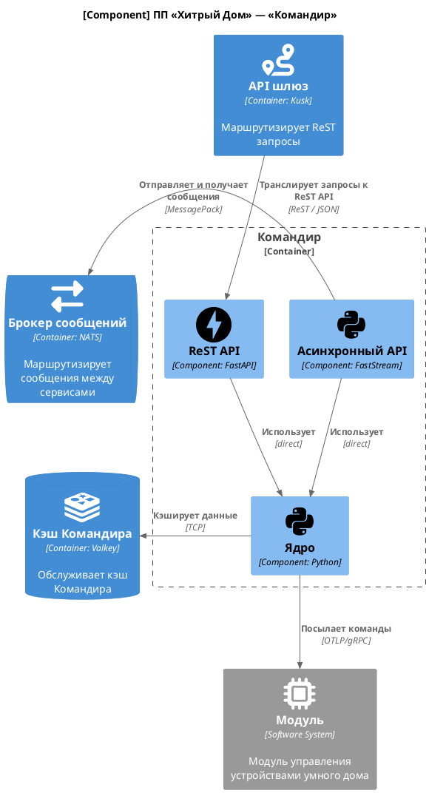

# Диаграмма компонента «Командир» (C4)

```puml
@startuml
!include <C4/C4_Component>
!include <tupadr3/common>
!include <tupadr3/devicons2/fastapi>
!include <tupadr3/devicons2/postgresql>
!include <tupadr3/devicons2/redis>
!include <tupadr3/font-awesome-6/microchip>
!include <tupadr3/font-awesome-6/right_left>
!include <tupadr3/font-awesome-6/route>
!include <tupadr3/font-awesome-6/python>

title [Component] ПП «Хитрый Дом» — «Командир»

Container(apigw, "API шлюз", "Container: Kusk", \
    "Маршрутизирует ReST запросы", $sprite=route)  
ContainerQueue(broker, "Брокер сообщений", "Container: NATS", \
    "Маршрутизирует сообщения между сервисами", $sprite=right_left)

Container_Boundary(cb, "Командир") {
    Component(commander_core, "Ядро", "Component: Python", \
        $sprite=python)
    Component(commander_rest, "ReST API", "Component: FastAPI", \
        $sprite=fastapi)
    Component(commander_async, "Асинхронный API", "Component: FastStream", $sprite=python)
}

ContainerDb(cache_commander, "Кэш Командира", \
    "Container: Valkey", "Обслуживает кэш Командира", $sprite=redis)
System_Ext(module, "Модуль", "Модуль управления устройствами умного дома", \
    $sprite=microchip, $type="Software System")

Rel(commander_rest, commander_core, "Использует", $techn="direct")
Rel(commander_async, commander_core, "Использует", $techn="direct")
Rel_L(commander_core, cache_commander, "Кэширует данные", \
    $techn="TCP")
Rel(commander_core, module, "Посылает команды", $techn="OTLP/gRPC")

Rel(apigw, commander_rest, "Транслирует запросы к ReST API", \
    $techn="ReST / JSON")
Rel_L(commander_async, broker, "Отправляет и получает сообщения", \
    $techn="MessagePack")

@enduml
```
