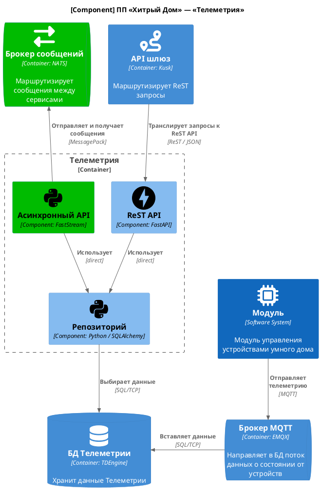

# Диаграмма компонента «Телеметрия» (C4)

```puml
@startuml
!include <C4/C4_Component>
!include <tupadr3/common>
!include <tupadr3/devicons2/fastapi>
!include <tupadr3/devicons2/opentelemetry>
!include <tupadr3/font-awesome-6/database>
!include <tupadr3/font-awesome-6/microchip>
!include <tupadr3/font-awesome-6/python>
!include <tupadr3/font-awesome-6/right_left>
!include <tupadr3/font-awesome-6/route>

title [Component] ПП «Хитрый Дом» — «Телеметрия»

Container(apigw, "API шлюз", "Container: Kusk", \
    "Маршрутизирует ReST запросы", $sprite=route)
    
ContainerQueue(broker, "Брокер сообщений", "Container: NATS", \
    "Маршрутизирует сообщения между сервисами", $sprite=right_left) #00bb00

Container_Boundary(cb, "Телеметрия") {
    Component(telemetry_repo, "Репозиторий", "Component: Python / SQLAlchemy", \
        $sprite=python)
    Component(telemetry_rest, "ReST API", "Component: FastAPI", \
        $sprite=fastapi)
    Component(telemetry_async, "Асинхронный API", "Component: FastStream", \
        $sprite=python) #00bb00
}

System(module, "Модуль", "Модуль управления устройствами умного дома", \
    $sprite=microchip, $type="Software System")
ContainerQueue(collector, "Брокер MQTT", "Container: EMQX", \
    "Направляет в БД поток данных о состоянии от устройств")
ContainerDb(db_telemetry, "БД Телеметрии", "Container: TDEngine", \
    "Хранит данные Телеметрии", $sprite=database)

Rel(telemetry_rest, telemetry_repo, "Использует", $techn="direct")
Rel_D(telemetry_async, telemetry_repo, "Использует", $techn="direct")
Rel(telemetry_repo, db_telemetry, "Выбирает данные", $techn="SQL/TCP")

Rel(apigw, telemetry_rest, "Транслирует запросы к ReST API", \
    $techn="ReST / JSON")
Rel_U(telemetry_async, broker, "Отправляет и получает сообщения", \
    $techn="MessagePack")

Rel(module, collector, "Отправляет телеметрию", $techn="MQTT")
Rel_L(collector, db_telemetry, "Вставляет данные", $techn="SQL/TCP")

@enduml
```
