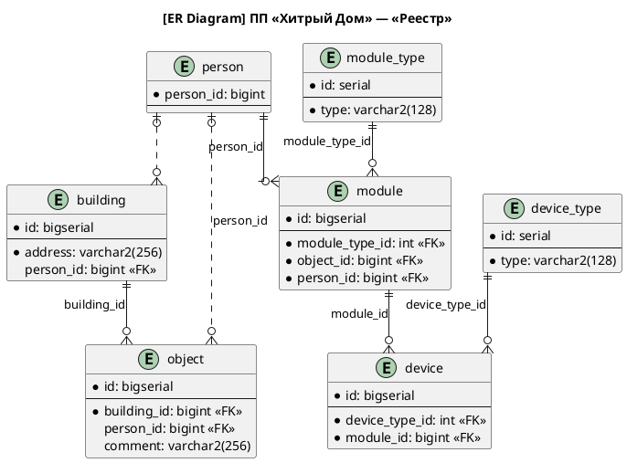

# ER-диаграмма микросервиса «Реестр»

```puml
@startuml
'hide circle
skinparam linetype ortho

title [ER Diagram] ПП «Хитрый Дом» — «Реестр»

entity "person" as person {
    * person_id: bigint
    --
}

entity "building" as building {
    * id: bigserial
    --
    * address: varchar2(256)
    person_id: bigint <<FK>>
}

entity "object" as object {
    * id: bigserial
    --
    * building_id: bigint <<FK>>
    person_id: bigint <<FK>>
    comment: varchar2(256)    
}

entity "module_type" as module_type {
    * id: serial
    --
    * type: varchar2(128)
}

entity "module" as module {
    * id: bigserial
    --
    * module_type_id: int <<FK>>
    * object_id: bigint <<FK>>
    * person_id: bigint <<FK>>
}

entity "device_type" as device_type {
    * id: serial
    --
    * type: varchar2(128)
}

entity "device" as device {
    * id: bigserial
    --
    * device_type_id: int <<FK>>
    * module_id: bigint <<FK>>
}

building ||--o{ object: building_id
person |o..o{ building
person |o..o{ object: person_id
person ||--o{ module: person_id
module ||--o{ device: module_id
module_type ||--o{ module: module_type_id
device_type ||--o{ device: device_type_id

@enduml
```
