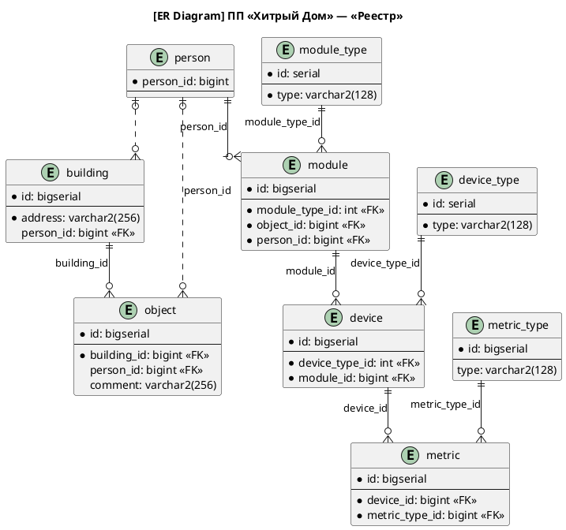

# ER-диаграмма микросервиса «Реестр»

На диаграмме отражены только самые основные атрибуты. В реальности таблицах могут быть и другие столбцы.

Данные в таблицу `person` подтягиваются из микросервиса, управляющим пользовательскими данными. Таблицы `building`, `object`, `module_type`, `device_type`, `metric_type` заполняются через административный интерфейс. Данные в `module`, `device`, `metric` «провижионятся» из микросервиса «Телеметрия».

