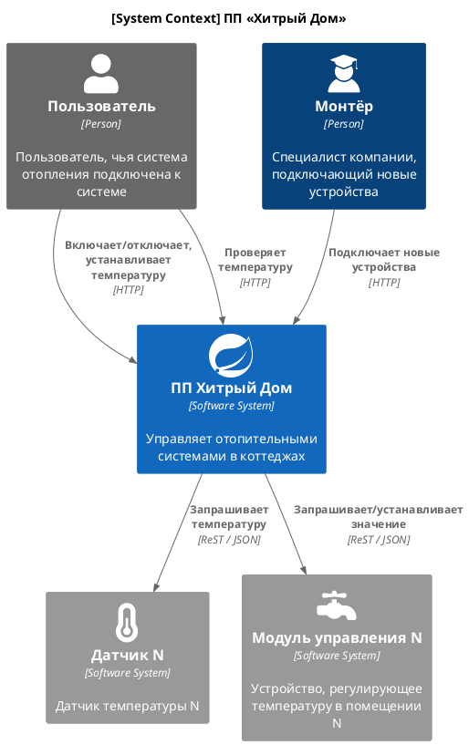

# Текущее состояние

Актуальная версия программного продукта (ПП) «Хитрый дом» имеет следующие основные характеристики:

* Позволяет только управлять отоплением в доме и проверять температуру.

* Каждая установка любого устройства сопровождается выездом специалиста по подключению системы отопления. Самостоятельно подключить свой датчик к системе пользователь не может.

В настоящее время к системе подключено 100 модулей управления отоплением.

## Диаграмма контекста (C4)

## Функционал системы

В самом приложении можно выделить 2 домена: [Управление отопительными системами](#_4) и [Мониторинг температуры](#_5).

### Управление отопительными системами

* Пользователи могут удалённо включать/выключать отопление в своих домах.
* Пользователи могут устанавливать желаемую температуру.
* Система автоматически поддерживает заданную температуру, регулируя подачу тепла.

### Мониторинг температуры

* Система получает данные о температуре с датчиков, установленных в домах.
* Пользователи могут просматривать текущую температуру в своих домах через веб-интерфейс.

## Архитектура системы

В архитектурном плане система представляет монолитное контейнеризированное (Docker) приложение на Java с применением фреймворка SpringBoot.

* **Язык программирования**: Java

* **База данных**: PostgreSQL

* **Архитектура**: Монолитная, все компоненты системы (обработка запросов, бизнес-логика, работа с данными) находятся в рамках одного приложения.

* **Взаимодействие**: Синхронное, запросы обрабатываются последовательно.

* **Масштабируемость**: Ограничена, так как монолит сложно масштабировать по частям.

* **Развертывание**: Требует остановки всего приложения.

Всё управление идёт от сервера к датчику. Данные о температуре также получаются через запрос от сервера к датчику.
